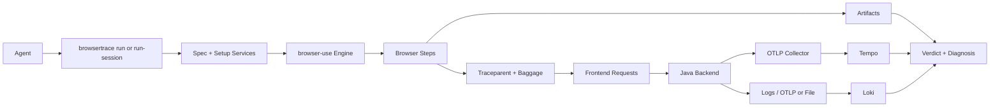

# Architecture

## Overview

BrowserTrace V2 has five main parts:

- `browsertrace` CLI: agent-facing command surface and JSON contracts
- Scenario runtime: spec loading, service orchestration, step execution, artifact writing
- Browser engine: internal `browser-use` Python sidecar plus persistent CDP sessions
- Session judge layer: step-local verdicts plus session-level scenario aggregation
- Observability stack: OTLP ingest plus Tempo/Loki query backends

## High-level flow

## Main runtime model

### 1. `run`

- Loads one scenario spec
- Starts configured services if needed
- Runs all browser steps end to end
- Writes one run report with correlated trace/log artifacts

### 2. `run-session *`

- Starts detached services and a persistent browser session
- Resumes one step or a contiguous step range through `--through-step`
- Stores per-step history under one persistent session manifest
- Computes session-level scenario verdicts through `run-session judge`

### 3. `java-debug *`

- Scans compiled classes
- Generates Java agent profile files
- Starts the demo backend with the OpenTelemetry Java agent
- Enables method-level spans for selected application methods

### 4. `trace *`

- Queries Tempo for traces
- Queries Loki for logs
- Correlates both sides using the shared `trace_id`

### 5. `judge` and `diagnose`

- `judge`: recomputes a single run verdict from stored artifacts
- `diagnose`: summarizes the likely root cause for a single run
- `run-session judge`: computes a scenario verdict from persistent session history

## Artifact model

Each run writes to `~/.browsertrace/artifacts/<run-id>/`.

Important subdirectories:

- `runtime/`: page state, network, console, screenshots, AI summary
- `correlation/`: trace and log lookup outputs
- `~/.browsertrace/run-sessions/<session-id>/`: persistent browser/service session state and step history

## AI-oriented design

The runtime layer intentionally writes two kinds of data:

- Raw evidence:
  - `network-detailed.json`
  - `console-detailed.json`
  - `page.html`
  - `post-action.png`
- Pre-digested conclusions:
  - `ai-summary.json`
  - `action-network-detailed.json`
  - `action-console-detailed.json`
  - `page-state.json`

The goal is that an LLM can answer “what failed, where, and why?” from one run directory, or from an accumulated persistent session, without reconstructing the whole story manually.
