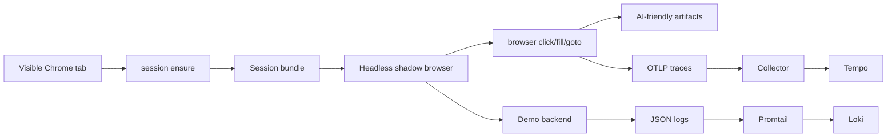

# Architecture

## Overview

BrowserTrace has four main parts:

- `browsertrace` CLI: command parsing, run context, trace export, artifact writing
- Session broker: attaches to Chrome over CDP and extracts a reusable session bundle
- Shadow runtime: rehydrates the session in a fresh headless Chromium and executes actions
- Observability stack: OTLP Collector, Tempo, Loki, and Promtail

## High-level flow

## Main runtime model

### 1. `session ensure`

- Attaches to Chrome/Chromium over CDP
- Matches a page by origin and URL proximity
- Extracts cookies, local storage, session storage, and token-like values
- Saves a logical session bundle under `~/.browsertrace/sessions/<session-id>`

### 2. `browser *`

- Loads the saved session bundle
- Starts a fresh headless Chromium
- Rehydrates cookies and storage
- Installs `traceparent` and `baggage` injection for same-origin and allowlisted requests
- Executes the requested step
- Writes runtime artifacts and trace metadata

### 3. `java-debug *`

- Scans compiled classes
- Generates Java agent profile files
- Starts the demo backend with the OpenTelemetry Java agent
- Enables method-level spans for selected application methods

### 4. `trace *`

- Queries Tempo for traces
- Queries Loki for logs
- Correlates both sides using the shared `trace_id`

## Artifact model

Each run writes to `~/.browsertrace/artifacts/<run-id>/`.

Important subdirectories:

- `attach/`: CDP page matching details
- `bundle/`: extracted session summary
- `shadow/`: propagation state and rehydration validation
- `runtime/`: page state, network, console, screenshots, AI summary
- `correlation/`: trace and log lookup outputs

## AI-oriented design

The runtime layer intentionally writes two kinds of data:

- Raw evidence:
  - `network-detailed.json`
  - `console-detailed.json`
  - `page.html`
  - `post-action.png`
- Pre-digested conclusions:
  - `ai-summary.json`
  - `action-network-detailed.json`
  - `action-console-detailed.json`
  - `page-state.json`

The goal is that an LLM can answer “what failed, where, and why?” from one run directory without reconstructing the whole story manually.
